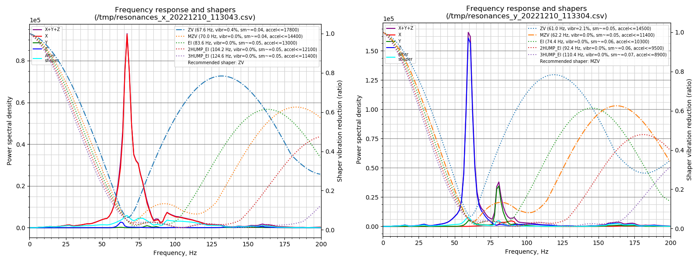

# klipper-extended-corexy-kinematic
Klipper module for extended-corexy kinematic support. 

## 0.Change logs

- Update to match klipper code 2025_Nov_7th db7acaa34a367c74c5551ab9649409fdadc7c5ae

## 1. Introduction
This kinematic is based on traditional CoreXY and hybrid-CoreXY (aka Markforged kinematic), aiming to improve the performance of large CoreXY-based 3D printers.

Check [kinematic page](./doc/kinematic.md) for more information about this kinematic.

## 2. Current firmware support state

 Support for extended coreXY kinematic is not merged into mainline Klipper yet, but we have working code and over 100 hours of test print without problem. There is plan to submit PR for this kinematic in the future. 

 You can find sample config at [sample config page](./doc/config.md)

 If you have any questions or suggestions, feel free to ask on our [SnakeOilXY discord](https://discord.gg/WZVP2HuAag)

## 3. Installation

Install kinematic file
<pre>
cd ~
git clone https://github.com/SnakeOilXY/klipper-extended-corexy-kinematic
cd klipper-extended-corexy-kinematic
./install.sh
</pre>

## 4. Test data

Input shaper test result on a 500x400x300mm machine

