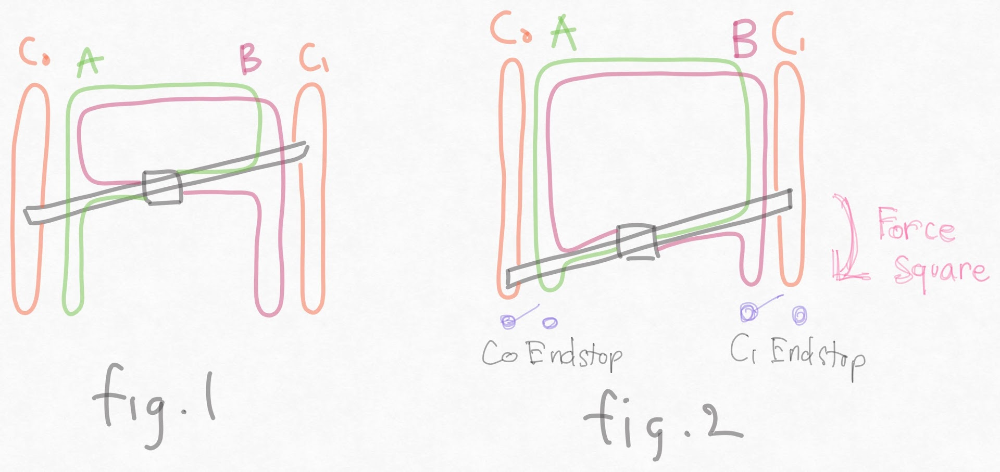

# Homing squence

As addressed in [kinematic page](./kinematic.md), extended-coreXY design can address gantry skew problem of traditional CoreXY, but require special homing squence.

- For example, we have skewed gantry like in fig.1 and we home Y axis with independ endtops C0 and C1 on the front.
- C0 switch will trigger first
- To trigger C1 switch, C1 motor with short belt path will pull and force the gantry square.
- We have square gantry now, but the inner belt path (A and B) will be in unbalanced state because they are force pulled by the C1 motor and belt. 

To fix the unbalenced belt problem we need the following homing squence.

- Home X axis
- Move toolhead to middle of the X axis (so the distance between toolhead and motor of A and B somewhat equal)
- Home Y axis
- Disable AB motor (to release the inner unbalanced belt tension)
- Re-enable AB motors
- Re-home X axis

This is the example of <code>[homing_override]</code> i have on my machine
<pre>
[homing_override]
gcode:
    G91 
    G0 Z10
    
    ; home X axis
    G28 X

    ; move toolhed to middle of x axis
    G90
    G0 X220 F10000

    ; home Y
    G28 Y
    G0 Y10 F3000
    
    ; disable AB motor
    SET_STEPPER_ENABLE STEPPER=stepper_a ENABLE=0
    SET_STEPPER_ENABLE STEPPER=stepper_b ENABLE=0
    ; wait 1 sec
    G4 P1000
    ; re-enable AB motor
    SET_STEPPER_ENABLE STEPPER=stepper_a ENABLE=1
    SET_STEPPER_ENABLE STEPPER=stepper_b ENABLE=1

    ; re-home X
    G28 X

    G0 X220 Y150 F10000

    ; home Z
    G28 Z
    G0 Z10
axes: xyz
set_position_x: 220
set_position_y: 150
set_position_z: 100
</pre>
